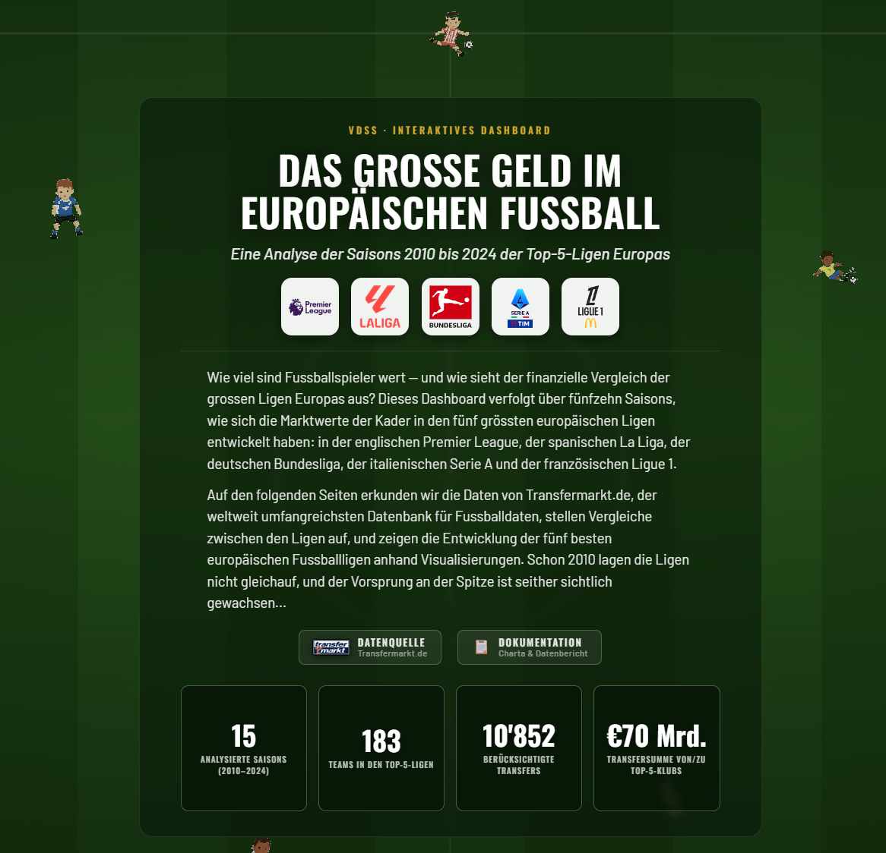
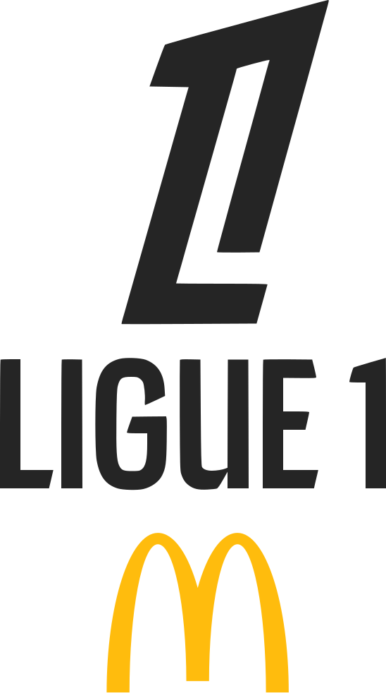

<div align="center">


<br>

&nbsp;&nbsp;&nbsp;
&nbsp;&nbsp;&nbsp;
&nbsp;&nbsp;&nbsp;
&nbsp;&nbsp;&nbsp;


<br><br>

[](https://vdss-fs26-ds25a.github.io/ds25a-2-fancyproject)

[](https://quarto.org)
[](https://www.python.org)
[](https://pandas.pydata.org)
[](https://plotly.com/python)
[](https://astral.sh/uv)
[](https://vdss-fs26-ds25a.github.io/ds25a-2-fancyproject)

<sub>
  <a href="#projektbeschreibung">Projektbeschreibung</a> ·
  <a href="#daten--methodik">Daten &amp; Methodik</a> ·
  <a href="#dashboard-lokal-erstellen">Lokal erstellen</a> ·
  <a href="#ordnerstruktur">Ordnerstruktur</a>
</sub>

</div>

---

## Projektbeschreibung

Dieses Projekt umfasst Visualisierungen und Analysen von Marktwerten, Transfersummen und weiteren Geldgeschäften im europäischen Spitzenfussball für den Zeitraum 2010–2025.

Das Dashboard bietet Einblicke in Marktwerttrends, Transferausgaben und Vergleiche in den Top-5-Ligen des europäischen Fussballverbands UEFA und dient als Analysewerkzeug für Sportdaten-Interessierte, Fussballfans und Soccer-Analytics-Spezialisten.

### Was das Dashboard zeigt

| Kapitel | Inhalt |
| :--- | :--- |
| **Kadermarktwerte** | Entwicklung der Liga-Kaderwerte über fünfzehn Saisons im direkten Vergleich |
| **Verteilung nach Verein** | Interaktive Treemap der Kaderwerte je Liga und Klub mit Vereinswappen |
| **Transferströme** | Sankey-Diagramm der Geldflüsse zwischen den Top-5-Ligen |
| **Transferbilanzen** | Kumulierte Netto-Transferbilanz je Liga — Nettokäufer vs. Nettoverkäufer |
| **Marktwert-Konzentration** | Verteilung der wertvollsten Spieler, regelbar von Top 10 bis Top 150 |
| **Wert &harr; Erfolg** | Korrelation zwischen Kaderwert und Tabellenplatz je Liga und Saison |
| **Rekord-Transfers** | Teuerster Transfer pro Saison über alle Ligen, mit Vereinswappen |

---

## Daten & Methodik

* **Datenakquise:** Wir nutzen einen automatisierten Scraper, um aktuelle und historische Marktwert- und Transferdaten direkt aus Transfermarkt.de zu beziehen.
* **Visualisierung:** Die aufbereiteten Datensätze werden mit Python (`pandas`, `plotly`) innerhalb des Quarto-Frameworks zu interaktiven Visualisierungen verarbeitet.
* **Deployment:** Das Dashboard wird via GitHub Actions auf GitHub Pages bereitgestellt.

> [!NOTE]
> Eine vollständige Dokumentation aller Roh- und verarbeiteten Datensätze, ihrer Schemata und Qualitätsmerkmale findet sich im **[Datenbericht](docs/data_report.qmd)**. Hinweis: «Marktwert» bezeichnet die geschätzten Spielerwerte von Transfermarkt, nicht den Vereins- oder Unternehmenswert.

### Scraper

Für die Vervollständigung der Datensätze und die Zusammenstellung von Saison-Datensätzen mit einem Eintrag pro Verein und Jahr wurde der Scraper von **[dcaribou](https://github.com/dcaribou)** über einen GitHub-Codespace geladen und leicht verändert ausgeführt.

---

## Dashboard lokal erstellen

### Voraussetzungen

Stelle sicher, dass [uv](https://github.com/astral-sh/uv) auf deinem System installiert ist.

### Installation

1. Repository klonen und in den Ordner `docs` wechseln.
2. Abhängigkeiten installieren und rendern (Befehle im Terminal bzw. in PowerShell ausführen):

   ```bash
   uv sync
   uv run quarto render
   ```

Die Webseite im `.html`-Format befindet sich anschliessend im Ordner `docs/build/`.

---

## Ordnerstruktur

```text
.
├── docs/                   # Quarto-Skripte und alle Logik-Elemente des Dashboards
│   ├── assets/             # Grafiken, Design-Elemente (u. a. Pixel-Sprites)
│   ├── data/               # Datensätze (CSV + Saison-JSONL)
│   ├── logos/              # Liga- und Vereinslogos
│   ├── data_report.qmd     # Skript Datenbericht
│   ├── index.qmd           # Skript Hauptseite Dashboard
│   ├── project_charta.qmd  # Skript Projektcharta
│   ├── styles.css          # Stylesheet
│   └── (...)
├── resources/              # Berichte, Präsentationen, PDFs, weitere Abgaben ausserhalb von Quarto
├── template-backup/        # Back-up der Vorlagenskripte
├── LICENSE                 # Lizenz
├── README.md               # Anleitung
└── (...)
```

---

## Quellen & Lizenz

* **Quellen:** siehe [`resources/sources.md`](resources/sources.md)
* **Lizenz:** weitere Informationen in der [`LICENSE`](LICENSE)-Datei

---

<div align="center">

**VDSS · FS26**

Jay Bärtschi &nbsp;·&nbsp; Noa Medved &nbsp;·&nbsp; John Wiese

</div>
